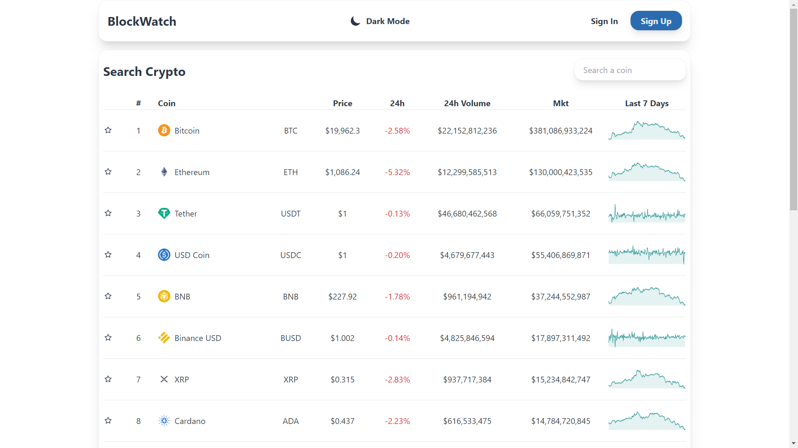

# Block Watch

## Built Witch

* React.js
  * Axios
    * Coin Gecko API
* Fire Base
* Tailwind CSS

# About This Project
This project is an application that allows users to create an account, save cryptocurrencies to a watch list, and view stats on the top 10 cryptocurrencies. It also allows users to switch between light and dark modes and saves the selected theme to Local Storage.

## The Design
I wanted this project to be easy to read and understand, and give it a basic layout while still looking modern, so I went with a Pneumorphic design style. I used React-Sparklines to style the price graphs.

## Skills Learned
I had a few skills that I wanted to focus on with this project and improve on. I had never used HTML tables before, and I am lacking in my API abilities. Since I am learning C# and ASP.Net I am gaining more familiarity with APIs and how they work and I need to practice implementing them in web projects.
I also wanted to experiment with different design styles and improve my skills with Firebase, and specifically Authentication and CRUD with it. I feel like I made some solid improvements with in my time with this project.